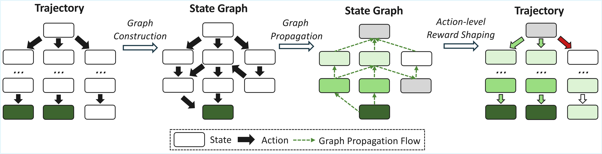

<h1 align="center">
<a href="https://arxiv.org/abs/2603.18859"><b>RewardFlow: Topology-Aware Reward Propagation on State Graphs 
for Agentic RL with Large Language Models</b></a>
</h1>



Reinforcement learning (RL) holds significant promise for enhancing the agentic reasoning capabilities of large language models (LLMs) with external environments. However, the inherent sparsity of terminal rewards hinders fine-grained, state-level optimization. Although process reward modeling offers a promising alternative, training dedicated reward models often entails substantial computational costs and scaling difficulties.
To address these challenges, we introduce RewardFlow, a lightweight method for estimating state-level rewards tailored to agentic reasoning tasks. RewardFlow leverages the intrinsic topological structure of states within reasoning trajectories by constructing state graphs. This enables an analysis of state-wise contributions to success, followed by topology-aware graph propagation to quantify contributions and yield objective, state-level rewards. When integrated as dense rewards for RL optimization, RewardFlow substantially outperforms prior RL baselines across four agentic reasoning benchmarks, demonstrating superior performance, robustness, and training efficiency.


# Installation (Follow [verl-agent](https://github.com/langfengQ/verl-agent))
## Install veRL
```bash
conda create -n verl-agent python==3.12 -y
conda activate verl-agent

pip3 install torch==2.6.0 --index-url https://download.pytorch.org/whl/cu124
pip3 install flash-attn==2.7.4.post1 --no-build-isolation

pip3 install -e .

pip3 install vllm==0.8.5
```

## Install Supported Environments
> ⚠️ **Important:** 
To run an agent in any of these environments, you must first install and configure the corresponding environment. We strongly recommend installing ***each environment in its own dedicated conda environment*** to avoid potential package version conflicts.

### 1. ALFWorld
Install with pip:
```bash
pip3 install gymnasium==0.29.1
pip3 install stable-baselines3==2.6.0
pip install alfworld
pip install vllm==0.8.5
```

Download PDDL & Game files and pre-trained MaskRCNN detector (will be stored in `~/.cache/alfworld/`):
```bash
alfworld-download -f
```

Use `--extra` to download pre-trained checkpoints and seq2seq data.

Play a Textworld game:
```bash
alfworld-play-tw
```
---

### 2. WebShop
WebShop requires Python <=3.10, so begin by creating a new `verl-agent-webshop` environment
```bash
conda create -n verl-agent-webshop python==3.10 -y
conda activate verl-agent-webshop
```

Install WebShop
```bash
cd ./agent_system/environments/env_package/webshop/webshop
./setup.sh -d all
```

Note: If you encounter issues with gdown, you may need to visit `https://drive.google.com/`, get your Google Drive cookie, and paste it into `.cache/gdown/cookies.txt`.
Or you may need to manually download the files.

After WebShop is installed, return to the root directory of the repository and install the verl package in `verl-agent`:
```bash
cd repo_root/
pip3 install torch==2.6.0 --index-url https://download.pytorch.org/whl/cu124
pip3 install flash-attn==2.7.4.post1 --no-build-isolation
pip3 install -e .
pip3 install vllm==0.8.2
# spacy 3.7.2 requires typer<0.10.0,>=0.3.0, but you have typer 0.15.2 which is incompatible.
# weasel 0.3.4 requires typer<0.10.0,>=0.3.0, but you have typer 0.15.2 which is incompatible.
```
The warnings can be safely ignored.

---

### 3. Search
```bash
cd ./agent_system/environments/env_package/search/third_party
pip install -e .
pip install gym==0.26.2
```

Prepare dataset (data will be saved at `~/data/searchR1_processed_direct`):
```bash
cd repo_root/
python examples/data_preprocess/preprocess_search_r1_dataset.py
```


Since faiss-gpu is not available via pip, we setup a separate conda environment for the local retrieval server. Running this server will use around 6GB of GPU memory per GPU, so make sure to account for this in your training run configuration. Build Retriever environments:
```bash
# Create and activate the retriever environment with Python 3.10
conda create -n retriever python=3.10 -y
conda activate retriever

# Install PyTorch (with GPU support) and related libraries
conda install numpy==1.26.4 # needed to stop incompatible version of numpy from being installed via pip
pip install torch==2.6.0 torchvision==0.21.0 torchaudio==2.6.0 --index-url https://download.pytorch.org/whl/cu124

# Install other Python packages
pip install transformers datasets pyserini huggingface_hub

# Install the GPU version of faiss
conda install faiss-gpu==1.8.0 -c pytorch -c nvidia -y

# Install the API service framework
pip install uvicorn fastapi
```

Download the index:
```bash
conda activate retriever

local_dir=~/data/searchR1
python examples/search/searchr1_download.py --local_dir $local_dir
cat $local_dir/part_* > $local_dir/e5_Flat.index
gzip -d $local_dir/wiki-18.jsonl.gz
```

Start the local flat e5 retrieval server: 
```bash
conda activate retriever

# redirect the output to a file to avoid cluttering the terminal
# we have observed outputting to the terminal causing spikes in server response times
bash examples/search/retriever/retrieval_launch.sh > retrieval_server.log 
```

### 4. Sokoban
```bash
pip install matplotlib
pip install gym==0.26.2
pip install gym_sokoban==0.0.6
```

# Run Examples

Please find scripts in the ["examples/"](./examples/) directory for training agents in different environments.

### 1. RewardFlow

```bash
bash examples/rewardflow_trainer/run_alfworld.sh # ALFWorld
```
```bash
bash examples/rewardflow_trainer/run_webshop.sh # WebShop
```
```bash
bash examples/rewardflow_trainer/run_search.sh # Search
```
```bash
bash examples/rewardflow_trainer/run_sokoban.sh # Sokoban
```

### 2. GiGPO

```bash
bash examples/gigpo_trainer/run_alfworld.sh # ALFWorld
```
```bash
bash examples/gigpo_trainer/run_webshop.sh # WebShop
```
```bash
bash examples/gigpo_trainer/run_search.sh # Search
```
```bash
bash examples/gigpo_trainer/run_sokoban.sh # Sokoban
```
### 3. GRPO
<!-- GRPO is a critic-free algorithm that estimates relative advantages based on a group of full episode trajectories. -->
```bash
bash examples/grpo_trainer/run_alfworld.sh # ALFWorld
```
```bash
bash examples/grpo_trainer/run_webshop.sh # WebShop
```
### 4. RLOO
```bash
bash examples/rloo_trainer/run_alfworld.sh # ALFWorld
```
```bash
bash examples/rloo_trainer/run_webshop.sh # WebShop
```


<!-- # Citation
If you find `RewardFlow` useful in your research or applications, please cite our paper:: -->

<!-- ```
@article{feng2025group,
  title={Group-in-Group Policy Optimization for LLM Agent Training},
  author={Feng, Lang and Xue, Zhenghai and Liu, Tingcong and An, Bo},
  journal={arXiv preprint arXiv:2505.10978},
  year={2025}
}
``` -->

## 🤝 Contributing

We welcome contributions to RewardFlow! Please feel free to:

- Report bugs and issues
- Suggest new features or improvements
- Submit pull requests

<a id="contact"></a>
## 📞 Contact

For questions, technical support, or collaboration inquiries:

- **Email**: [xiaofeng@comp.hkbu.edu.hk](mailto:xiaofeng@comp.hkbu.edu.hk)
<!-- - **Issues**: [GitHub Issues]() -->
